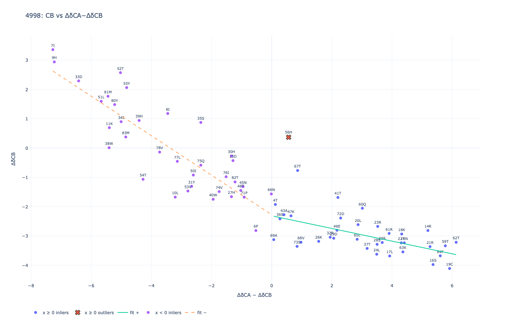
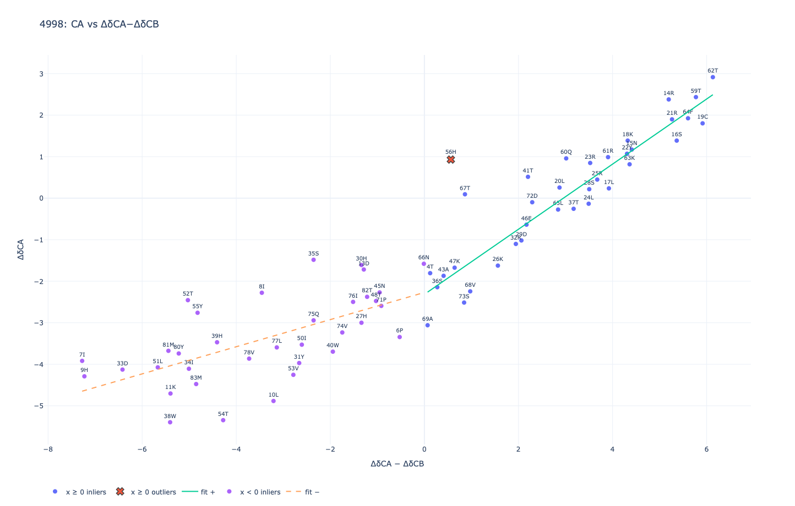
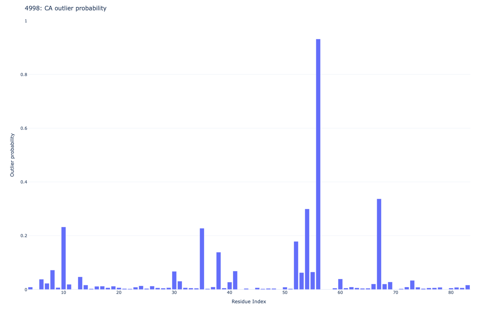

Outputs
=======

JSON report structure
---------------------

The output of :func:`pylacs.lacs.run_lacs` is a dictionary keyed by chemical-shift list ID.
Each list contains:

- ``offsets``: per-atom offsets (rounded to 3 decimals)
- ``offsets_split``: per-atom offsets for ``pos`` and ``neg`` sign partitions
- ``outliers``: per-atom list of residue records, each with:

  - ``residue_key``: entity, assembly, index, comp
  - ``x`` and ``y`` (the predictor and response used in the fit)
  - ``residual``
  - ``prob`` (soft outlier probability)
  - ``flag`` (binary indicator based on the cutoff)

- ``meta``: includes ``cutoff_k`` and ``used_side`` per atom

For the Bayesian method, additional keys are included:

- ``offsets_bayes``: mean, 95% credible interval, and SD of the offset
- ``offsets_bayes_sides``: posterior summaries per side (pos/neg)

Sample JSON outputs
^^^^^^^^^^^^^^^^^^^
Sample output from JSON file. `Click here for the full JSON file <_static/4998_bayes.json>`_

.. code-block:: bash

    offsets_bayes": {
      "ca": {
        "mean": 2.2931,
        "ci95": [
          1.9349,
          2.6402
        ],
        "sd": 0.1813
      }

STAR report structure
---------------------
In the STAR output file data items are organized in separate saveframes as tag-value. The tags are self
descriptive and organised as entry level metadata, chemical shift list metadata and fit data for each chemical shift list

Sample STAR output
^^^^^^^^^^^^^^^^^^
Sample output from STAR file. `Click here for the full STAR file <_static/4998_bayes.star>`_

.. code-block:: bash

    save_save_LACS_offsets
        _LACS_offsets.Sf_category  LACS_offsets
        loop\_
            _LACS_offsets.List_ID
            _LACS_offsets.Atom
            _LACS_offsets.Side
            _LACS_offsets.Value
            _LACS_offsets.Bayes_mean
            _LACS_offsets.Bayes_ci95_lo
            _LACS_offsets.Bayes_ci95_hi
            _LACS_offsets.Bayes_sd
            1   CA   pos       2.316    2.3158    1.8551    2.7444   0.2274
            1   CA   neg       2.271    2.2705    1.7195    2.8143   0.2784
            1   CB   pos       2.313    2.3133    1.8463    2.7407   0.2303
            1   CB   neg       2.276    2.2761    1.7294    2.8182   0.2789
            1   C    pos       3.918    3.918     2.7938    5.075    0.5858
            1   C    neg       2.788    2.7884    1.1978    4.3509   0.8043
            1   N    pos       2.026    2.0261    0.1625    3.9663   0.9798
            1   N    neg       -1.411   -1.4109   -4.6041   1.7828   1.6349
            1   HA   pos       0.066    0.0659    -0.0982   0.2223   0.0833
            1   HA   neg       -0.058   -0.058    -0.2956   0.1749   0.1187
            1   CA   overall   2.2931   2.2931    1.9349    2.6402   0.1813
            1   CB   overall   2.2947   2.2947    1.929     2.6403   0.1796
            1   C    overall   3.3532   3.3532    2.3673    4.3442   0.5007
            1   N    overall   0.3076   0.3076    -1.6033   2.1592   0.9497
            1   HA   overall   0.004    0.004     -0.1386   0.1433   0.0718`
        stop\_
        save\_

See :func:`pylacs.lacs.collect_and_report` and :func:`pylacs.lacs.collect_and_report_bayes`.

File naming
-----------

If explicit output paths are not provided:

- JSON: ``<data-id>_<method>.json``
- STAR: ``<data-id>_<method>.str``

These defaults are computed relative to the current working directory or ``--out``.

Plots
-----

If plotting is enabled and Plotly is available, pylacs writes linear fit and outlier probability plots both in
html and pdf format. If ``--out`` is not provided, plot files are written to ``./lacs_output`` (created if needed).

Sample plots
^^^^^^^^^^^^^
Linear fit of CB chemical shifts using Bayes method

    `Click here for interactive html version of the linear fit  <_static/4998_cb_1_bayes.html>`_

Outlier probability plot for CB chemical shifts using Bayes method

    `Click here for interactive html version of the probability plot <_static/4998_cb_1_bayes_prob.html>`_

Linear fit of CA chemical shifts using Bayes method

    `Click here for interactive html version of the linear fit  <_static/4998_ca_1_bayes.html>`_

Outlier probability plot for CA chemical shifts using Bayes method

    `Click here for interactive html version of the probability plot <_static/4998_ca_1_bayes_prob.html>`_

See :func:`pylacs.lacs.plot_all`.
